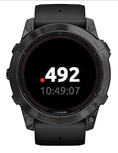

# Garmin Swatch Time

A minimalist, elegant, typography-focused Garmin Connect IQ watch face that displays the current time as Swatch time.





Available from [Garmin Connect IQ Developer portal](https://apps.garmin.com/apps/89c9595b-8f78-4647-a703-2103b9f2225b).


## Contents

* [Swatch time](#swatch-time)
* [Fonts](#fonts)
* [Build, test, deploy](#build-test-deploy)

## Swatch time

In [Swatch Time](https://en.wikipedia.org/wiki/Swatch_Internet_Time) (also known as _Swatch internet time_), "the mean solar day is divided into 1,000 equal parts called _.beats_, meaning each .beat lasts 86.4 seconds (1.440 minutes) in standard time, and an hour lasts for approximately 42 .beats. The time of day always references the amount of time that has passed since midnight (standard time) in Biel, Switzerland."

The Garmin Swatch Time watch face displays the time as `.beats`, 0-999.
Optionally, the user may turn on standard time, displayed in smaller font below the decimal time, using on-watch customization settings.
The user may also choose between two symbols for the _beats_: `@` (at) or `.` (dot)

**Note**  
The time is specific to the fixed location of Biel, Switerland.
Thus the value `.500` means noon Biel time, not watch local time.

## Fonts

The Braille Time watch face uses custom fonts:

* [Ubuntu](https://fonts.google.com/specimen/Ubuntu) for Swatch time (bold) and standard time (regular).

**Note**  
To not appear disproportionately big, the At (`@`) symbol is drawn in a slightly smaller font than the Swatch time itself.

The development process was as follows:

* The fonts were downloaded from [Google Fonts](https://fonts.google.com/) as True Type  (`.ttf`) fonts.
* The fonts were converted to bitmaps as `.fnt` and `.png` pairs using the open source command-line [`ttf2bmp`](https://github.com/wkusnierczyk/ttf2bmp) converter.
* The font sizes were established to match the Garmin Fenix 7X Solar watch 280x280 pixel screen resolution.
* The fonts were then scaled proportionally to match other screen sizes available on Garmin watches with round screens using the included [utility script](utils/generate_fonts.py).

The table below lists all font sizes provided for the supported screen resolutions.

| Element       | Font           | 218 | 240 | 260 | 280 | 360 | 390 | 416 | 454 |
| :------------ | :------------- | --: | --: | --: | --: | --: | --: | --: | --: |
| Swatch time   | Ubuntu bold    |  62 |  69 |  74 |  80 | 103 | 111 | 119 | 130 |
| At            | Ubuntu bold    |  47 |  51 |  56 |  60 |  77 |  84 |  89 |  97 |
| Standard time | Ubuntu regular |  23 |  26 |  28 |  30 |  39 |  42 |  45 |  49 |

## Build, test, deploy

To modify and build the sources, you need to have installed:

* [Visual Studio Code](https://code.visualstudio.com/) with [Monkey C extension](https://developer.garmin.com/connect-iq/reference-guides/visual-studio-code-extension/).
* [Garmin Connect IQ SDK](https://developer.garmin.com/connect-iq/sdk/).

Consult [Monkey C Visual Studio Code Extension](https://developer.garmin.com/connect-iq/reference-guides/visual-studio-code-extension/) for how to execute commands such as `build` and `test` to the Monkey C runtime.

You can use the included `Makefile` to conveniently trigger some of the actions from the command line.

```bash
# build binaries from sources
make build

# run unit tests
make test

# run the simulation
make run
```

To sideload your application to your Garmin watch, see [developer.garmin.com/connect-iq/connect-iq-basics/your-first-app](https://developer.garmin.com/connect-iq/connect-iq-basics/your-first-app/).
